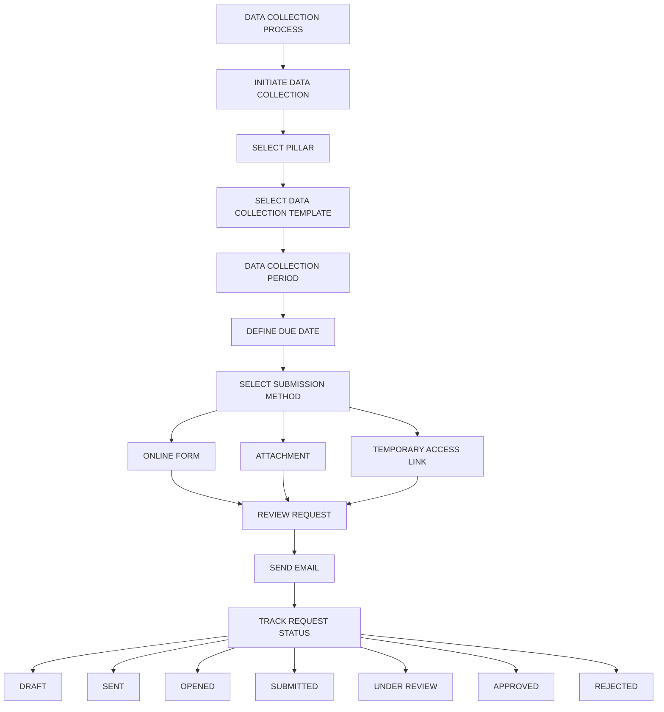
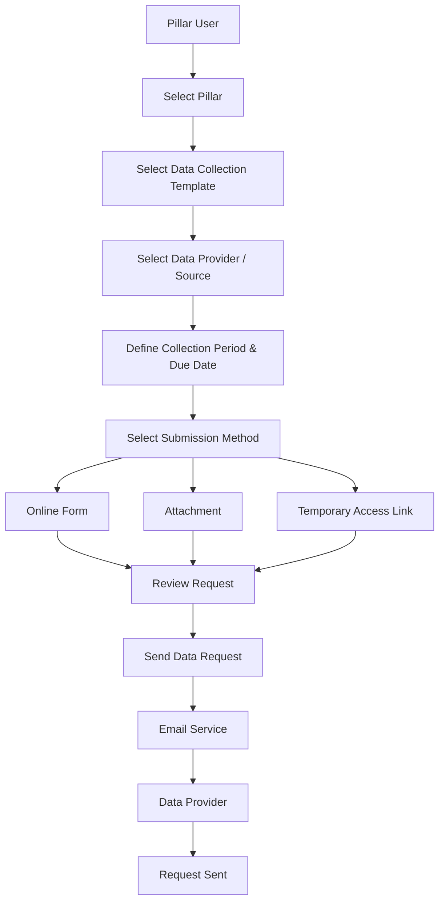
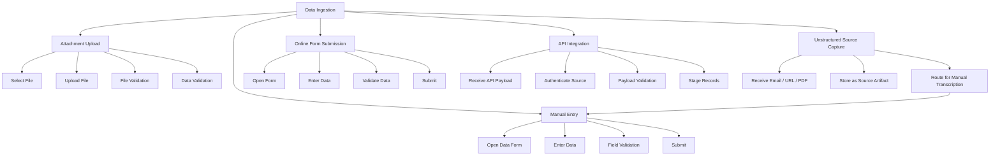
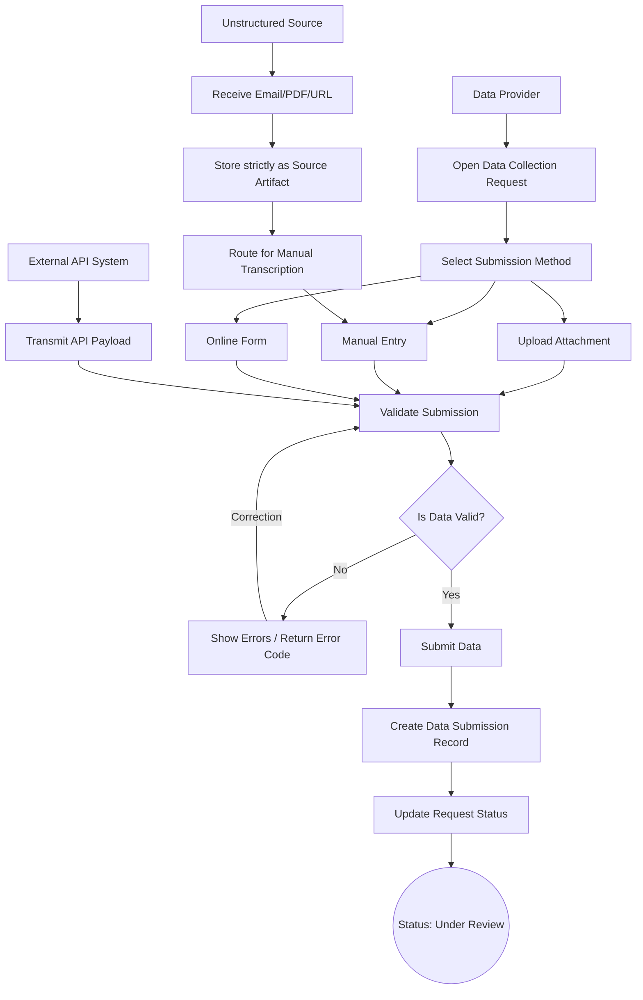
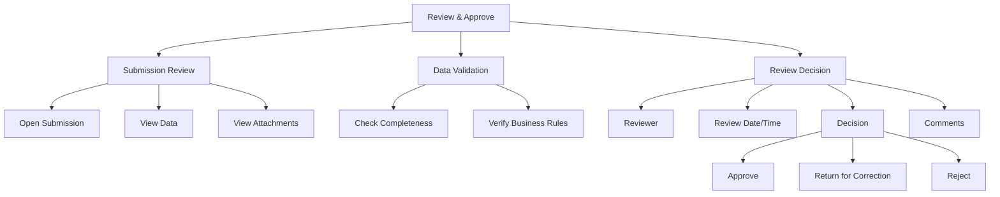
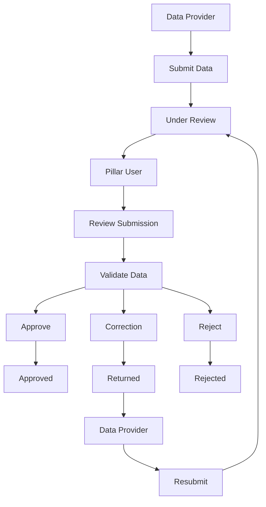
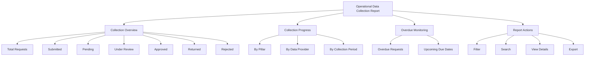
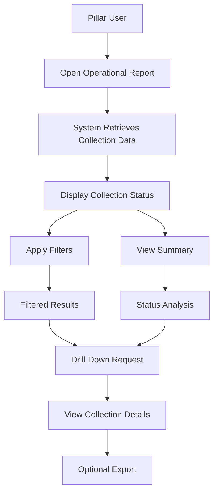
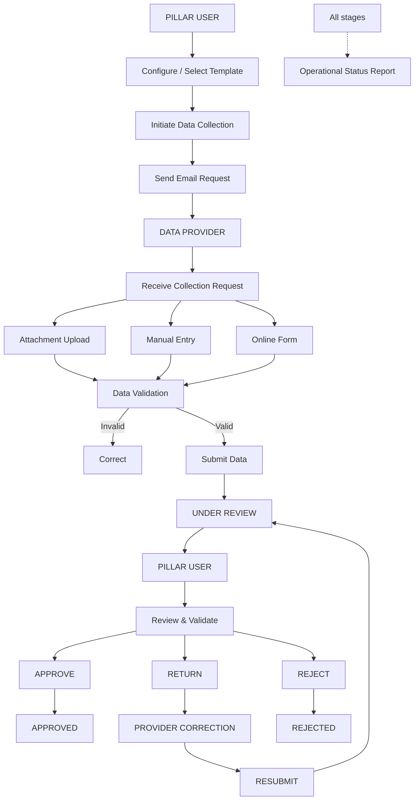
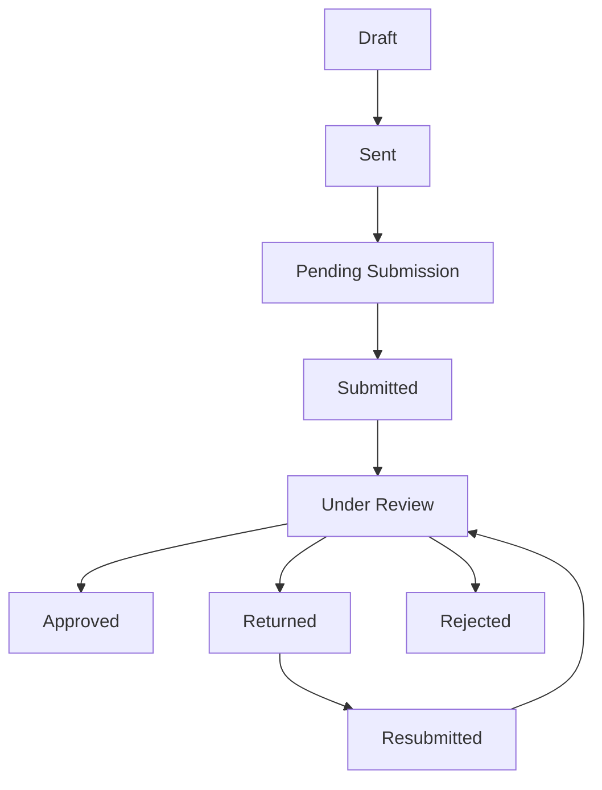

**4.2.2 Data Collection Process**

**4.2.2.1 Initiate Data Collection**

**A. Functional Purpose**

The **Initiate Data Collection** functionality enables the Pillar User to initiate a data collection request from the system by selecting the required data collection template, defining the applicable data provider/source, and sending the request through email.

The functionality supports the following key data submission and access mechanisms:

1. **Online Form** – The data provider receives a link to an online data collection form and submits the required information directly through the application.
2. **Attachment-Based Submission** – The data provider receives the data collection request through email and submits the requested data using the prescribed attachment/template.
3. **Temporary Contributor Access** – The system generates secure, one-time, hash-only access links for external data providers to ensure secure, tokenless entry without exposing raw credentials. This includes token expiry monitoring and administrative resend/revoke controls.

The system shall maintain the complete lifecycle of the data collection request, including request creation, email dispatch, submission status, reminders, and subsequent review.

**B. Business Definitions**

| **Term** | **Definition** |
| --- | --- |
|  |  |
| Pillar | A configured business/functional area for which data is collected. |
| Pillar User | Authorized user responsible for initiating, monitoring, reviewing and approving data collection activities for a Pillar. |
| Data Provider | Internal or external party responsible for providing the requested data. |
| Data Collection Template | Configured structure defining the fields, dimensions, indicators and data requirements to be submitted. |
| Data Collection Request | A system-generated request created by a Pillar User to obtain data from a Data Provider. |
| Online Form | Application-based form through which a Data Provider directly enters and submits data. |
| Attachment | File submitted by the Data Provider containing the requested data. |
|  |  |
| Collection Period | The reporting period for which data is being requested. |
| Due Date | The deadline by which the Data Provider is expected to submit the requested data. |
| Request Status | Current lifecycle state of a data collection request. |

**C. Functional Hierarchy Diagram**

**Diagram type:** Functional hierarchy diagram  
**Diagram ID:** DIA-DCP-001  
**Diagram:**

**D. Ownership, Approval Authority, Actors and Access**

| **Functional Area** | **Owning Division** | **Operational Ownership** | **Approval Authority** |
| --- | --- | --- | --- |
| Data Collection Initiation | Pillar | Pillar User | Pillar Manager / Authorized Approver |
| Data Collection Template Selection | Pillar | Pillar User | Pillar Manager |
| Data Provider Selection | Pillar | Pillar User | Pillar Manager |
| Email Initiation | Pillar | Pillar User | Not Applicable |
| Collection Request Monitoring | Pillar | Pillar User | Pillar Manager |

**Actors:**

* Pillar User
* Data Provider
* System/Application
* Email Service

**E. Functional Requirements**

|  |  |  |  |  |  |  |  |
| --- | --- | --- | --- | --- | --- | --- | --- |
| **Requirement ID** | **Module Name** | **Requirement Description** | **Priority** | **Stakeholder** | **Business Rule ID** | **Acceptance Criteria ID** | **D­­ependency ID** |
| ­­  FR-DCP-001 | Initiate Data Collection | The system shall allow an authorized Pillar User to initiate a data collection request. | High | Pillar User | BR-DCP-001 | AC-DCP-001 | DEP-DCP-001 |
| FR-DCP-002 | Initiate Data Collection | The system shall allow the Pillar User to select the applicable Pillar. | High | Pillar User | BR-DCP-002 | AC-DCP-002 | DEP-DCP-002 |
| FR-DCP-003 | Initiate Data Collection | The system shall allow the Pillar User to select an approved Data Collection Template. | High | Pillar User | BR-DCP-003 | AC-DCP-003 | DEP-DCP-003 |
| FR-DCP-004 | Initiate Data Collection | The system shall allow the Pillar User to select one or more Data Providers/Sources. | High | Pillar User | BR-DCP-004 | AC-DCP-004 | DEP-DCP-004 |
| FR-DCP-005 | Initiate Data Collection | The system shall allow the user to define the collection period and due date. | High | Pillar User | BR-DCP-005 | AC-DCP-005 | DEP-DCP-005 |
| FR-DCP-006 | Initiate Data Collection | The system shall support Online Form and Attachment submission methods. | High | Pillar User | BR-DCP-006 | AC-DCP-006 | DEP-DCP-003 |
| FR-DCP-007 | Initiate Data Collection | The system shall generate and send a data collection email to the selected Data Provider. | High | Pillar User | BR-DCP-007 | AC-DCP-007 | DEP-DCP-006 |
| FR-DCP-008 | Initiate Data Collection | The system shall generate a unique Data Collection Request ID. | High | System | BR-DCP-008 | AC-DCP-008 | DEP-DCP-001 |
| FR-DCP-009 | Initiate Data Collection | The system shall record the request status and timestamp of request initiation. | High | System | BR-DCP-009 | AC-DCP-009 | DEP-DCP-001 |

**F. Business Rules**

| **Business Rule ID** | **Business Rule** |
| --- | --- |
| BR-DCP-001 | Only authorized Pillar Users shall be allowed to initiate data collection requests. |
| BR-DCP-002 | A Pillar User shall only be able to initiate collection for Pillars to which they have access. |
| BR-DCP-003 | Only active and approved Data Collection Templates shall be available for selection. |
| BR-DCP-004 | Only active Data Providers/Sources shall be available for selection. |
| BR-DCP-005 | The due date shall not be earlier than the request initiation date. |
| BR-DCP-006 | The submission method shall be determined based on the configured Data Collection Template and business requirement. |
| BR-DCP-007 | An email shall only be sent when all mandatory request information has been completed. |
| BR-DCP-008 | Each collection request shall have a unique system-generated Request ID. |
| BR-DCP-009 | The system shall maintain an audit trail for request creation and email dispatch. |
| BR-DCP-010 | The system shall enforce token secrecy for temporary access links; expired or administratively revoked links must immediately block access. |

**G. Application Workflows**

**Diagram type:** Functional activity diagram  
**Workflow ID:** WF-DCP-001

|  |  |  |  |  |  |
| --- | --- | --- | --- | --- | --- |
| **Step** | **Actor/System** | **Action** | **System Response** | **Status/Output** | **Linked Requirement IDs** |
| 1 | Pillar User | Selects Pillar | System displays accessible Pillars | Pillar selected | FR-DCP-002 |
| 2 | Pillar User | Selects template | System displays active templates | Template selected | FR-DCP-003 |
| 3 | Pillar User | Selects Data Provider | System validates provider | Provider selected | FR-DCP-004 |
| 4 | Pillar User | Defines collection period and due date | System validates dates | Collection period defined | FR-DCP-005 |
| 5 | Pillar User | Selects submission method | System configures corresponding submission mechanism | Method selected | FR-DCP-006 |
| 6 | Pillar User | Reviews request | System displays request summary | Request ready for dispatch | FR-DCP-001 |
| 7 | Pillar User | Sends request | System creates Request ID and triggers email | Request sent | FR-DCP-007, FR-DCP-008 |
| 8 | System | Records request | System stores status and timestamp | Status = Sent | FR-DCP-009 |

**H. Module-wise UI/Wireframes**

|  |  |  |  |  |  |  |
| --- | --- | --- | --- | --- | --- | --- |
| **UI ID** | **Screen/Page** | **Wireframe/Mockup Ref** | **Authorized Actor** | **Fields/Controls** | **Actions/States/Validations** | **Linked Requirement IDs** |
| UI-DCP-001 | Initiate Data Collection | WF-DCP-UI-001 | Pillar User | Pillar, Template, Provider, Collection Period, Due Date | Mandatory field validation | FR-DCP-001 to FR-DCP-005 |
| UI-DCP-002 | Submission Method | WF-DCP-UI-002 | Pillar User | Online Form / Attachment | Submission method selection | FR-DCP-006 |
| UI-DCP-003 | Request Preview | WF-DCP-UI-003 | Pillar User | Request summary, recipient, template, due date | Review/Edit/Send | FR-DCP-007 |
| UI-DCP-004 | Collection Request Listing | WF-DCP-UI-004 | Pillar User | Request ID, Provider, Period, Due Date, Status | Search, filter, view | FR-DCP-009 |

**I. Dependencies**

|  |  |  |  |  |
| --- | --- | --- | --- | --- |
| **Dependency ID** | **Dependency/Required Input** | **Owner/Source** | **Required By** | **Impact if Unavailable** |
| DEP-DCP-001 | User authentication and authorization | Application | Request initiation | User cannot initiate request |
| DEP-DCP-002 | Configured Pillars | Pillar Configuration | Pillar selection | Request cannot be created |
| DEP-DCP-003 | Active Data Collection Templates | Template Configuration | Template selection | Request cannot be created |
| DEP-DCP-004 | Data Provider/Source master | Application/Pillar | Provider selection | Request cannot be addressed |
| DEP-DCP-005 | Collection period configuration | Pillar User | Request creation | Request cannot be finalized |
| DEP-DCP-006 | Email service | Application/Infrastructure | Email dispatch | Request remains unsent |

**J. Acceptance Criteria**

|  |  |  |  |
| --- | --- | --- | --- |
| **Acceptance Criteria ID** | **Linked Requirements** | **Scenario** | **Acceptance Criteria** |
| AC-DCP-001 | FR-DCP-001 | Authorized user initiates collection | System allows the user to create a request. |
| AC-DCP-002 | FR-DCP-002 | User selects Pillar | Only authorized Pillars are displayed. |
| AC-DCP-003 | FR-DCP-003 | User selects template | Only active approved templates are displayed. |
| AC-DCP-004 | FR-DCP-004 | User selects provider | Active providers are available for selection. |
| AC-DCP-005 | FR-DCP-005 | User enters dates | System validates the collection period and due date. |
| AC-DCP-006 | FR-DCP-006 | User selects submission method | System supports the configured submission method. |
| AC-DCP-007 | FR-DCP-007 | User sends request | Data Provider receives the collection email successfully. |
| AC-DCP-008 | FR-DCP-008 | Request is created | System generates a unique Request ID. |
| AC-DCP-009 | FR-DCP-009 | Request is dispatched | Request status and timestamp are recorded. |

**4.2.2.2 Data Ingestion**

**A. Functional Purpose**

The **Data Ingestion** functionality enables the system to receive data submitted by Data Providers through the configured collection mechanism.

The functionality shall support five modes of data ingestion:

1. **Attachment Upload** – Data Provider uploads a completed data file.
2. **Manual Entry** – Authorized user enters data directly into the application.
3. **Online Form Submission** – Data Provider submits data through the online form.
4. **API Integration** – Automated ingestion from authorized external ministry/department systems via REST APIs.
5. **Unstructured Source Capture** – Automated extraction from URLs, email bodies, and system-generated PDFs.

*Note: Scanned or non-machine-readable documents are ingested and securely stored as source artifacts, and are automatically routed for manual transcription or clarification (direct OCR is excluded in the primary phase).*

The system shall validate the submitted data against the configured Data Collection Template and maintain the submission against the corresponding Data Collection Request.

**B. Business Definitions**

| **Term** | **Definition** |
| --- | --- |
| Data Submission | Data submitted against a Data Collection Request. |
| Manual Entry | Direct entry of required data into application fields by an authorized user. |
| Attachment Upload | Upload of a file containing requested data. |
| Online Form Submission | Submission of data through a system-generated online form. |
| Validation | System-based verification of data format, completeness and configured business rules. |
| Submission Status | Current state of a submitted data package. |
| Data Source | Source/entity from which the data originates. |

**C. Functional Hierarchy Diagram**

**Diagram type:** Functional hierarchy diagram  
**Diagram ID:** DIA-DCP-002

**D. Ownership, Approval Authority, Actors and Access**

|  |  |  |  |
| --- | --- | --- | --- |
| **Functional Area** | **Owning Division** | **Operational Ownership** | **Approval Authority** |
| Attachment Upload | Pillar | Data Provider / Authorized User | Pillar User |
| Manual Data Entry | Pillar | Authorized User | Pillar User |
| Online Form Submission | Pillar | Data Provider | Pillar User |
| API Integration | Application | External System / System | Pillar User |
| Unstructured Source Capture | Application | System (Capture) / Pillar User (Transcription) | Pillar User |
| Data Validation | Application | System | Pillar User |
| Submission Management | Pillar | Pillar User | Pillar Manager |

**E. Functional Requirements**

|  |  |  |  |  |  |  |  |
| --- | --- | --- | --- | --- | --- | --- | --- |
| **Requirement ID** | **Module Name** | **Requirement Description** | **Priority** | **Stakeholder** | **Business Rule ID** | **Acceptance Criteria ID** | **Dependency ID** |
| FR-DCP-010 | Data Ingestion | The system shall allow a Data Provider to access the assigned data collection request. | High | Data Provider | BR-DCP-010 | AC-DCP-010 | DEP-DCP-007 |
| FR-DCP-011 | Data Ingestion | The system shall support attachment upload for applicable collection requests. | High | Data Provider | BR-DCP-011 | AC-DCP-011 | DEP-DCP-008 |
| FR-DCP-012 | Data Ingestion | The system shall support manual data entry for authorized users. | High | Authorized User | BR-DCP-012 | AC-DCP-012 | DEP-DCP-003 |
| FR-DCP-013 | Data Ingestion | The system shall support online form submission. | High | Data Provider | BR-DCP-013 | AC-DCP-013 | DEP-DCP-003 |
| FR-DCP-014 | Data Ingestion | The system shall support automated API-based data ingestion from authorized external systems. | Medium | System | BR-DCP-014 | AC-DCP-014 | DEP-DCP-007 |
| FR-DCP-015 | Data Ingestion | The system shall support capturing unstructured sources (emails, URLs) and storing them strictly as source artifacts for manual transcription routing. | High | System | BR-DCP-015 | AC-DCP-015 | DEP-DCP-007 |
| FR-DCP-016 | Data Ingestion | The system shall validate mandatory fields before submission. | High | System | BR-DCP-016 | AC-DCP-016 | DEP-DCP-003 |
| FR-DCP-017 | Data Ingestion | The system shall validate uploaded files against configured file rules. | High | System | BR-DCP-017 | AC-DCP-017 | DEP-DCP-008 |
| FR-DCP-018 | Data Ingestion | The system shall associate every submission with the corresponding Data Collection Request ID. | High | System | BR-DCP-018 | AC-DCP-018 | DEP-DCP-007 |
| FR-DCP-019 | Data Ingestion | The system shall record submission date, time, submitting actor and submission method. | High | System | BR-DCP-019 | AC-DCP-019 | DEP-DCP-007 |
| FR-DCP-020 | Data Ingestion | The system shall update the Data Collection Request status after successful submission. | High | System | BR-DCP-020 | AC-DCP-020 | DEP-DCP-007 |

**F. Business Rules**

| **Business Rule ID** | **Business Rule** |
| --- | --- |
| BR-DCP-010 | A Data Provider shall only access requests assigned to them. |
| BR-DCP-011 | Only configured and supported file formats shall be accepted. |
| BR-DCP-012 | Manual entry shall only be available to users with appropriate access. |
| BR-DCP-013 | Online forms shall display only fields configured for the associated template. |
| BR-DCP-014 | API payloads must be authenticated against pre-configured source credentials before processing. |
| BR-DCP-015 | Scanned or non-machine-readable submissions shall not be processed as structured data but retained as source artifacts. |
| BR-DCP-016 | Mandatory fields must be completed before submission. |
| BR-DCP-017 | Uploaded files shall be validated for file type, structure and required content. |
| BR-DCP-018 | Every submission shall be linked to exactly one Data Collection Request. |
| BR-DCP-019 | The system shall maintain submission audit information. |
| BR-DCP-020 | A successfully submitted request shall move to the appropriate review status. |

**G. Application Workflows**

**Workflow ID:** WF-DCP-002

|  |  |  |  |  |  |
| --- | --- | --- | --- | --- | --- |
| **Step** | **Actor/System** | **Action** | **System Response** | **Status/Output** | **Linked Requirement IDs** |
| 1 | Data Provider | Opens assigned request | System displays request and template | Request opened | FR-DCP-010 |
| 2 | Data Provider | Selects submission mechanism | System displays corresponding interface | Submission started | FR-DCP-011 to FR-DCP-013 |
| 3 | Data Provider | Enters/uploads data | System receives submission | Data captured | FR-DCP-011 to FR-DCP-013 |
| 4 | System | Validates data | System checks configured rules | Valid/Invalid | FR-DCP-016, FR-DCP-017 |
| 5 | Data Provider | Corrects validation errors if applicable | System revalidates | Valid submission | FR-DCP-016 |
| 6 | Data Provider | Submits data | System creates submission record | Submission created | FR-DCP-018 |
| 7 | System | Records submission metadata | System stores actor, time and method | Audit record created | FR-DCP-019 |
| 8 | System | Updates request | System changes status | Status = Under Review | FR-DCP-020 |

**H. Module-wise UI/Wireframes**

|  |  |  |  |  |  |  |
| --- | --- | --- | --- | --- | --- | --- |
| **UI ID** | **Screen/Page** | **Wireframe/Mockup Ref** | **Authorized Actor** | **Fields/Controls** | **Actions/States/Validations** | **Linked Requirement IDs** |
| UI-DCP-005 | Data Collection Request | WF-DCP-UI-005 | Data Provider | Request details, collection period, due date | View request | FR-DCP-010 |
| UI-DCP-006 | Attachment Upload | WF-DCP-UI-006 | Data Provider | File upload, file information | File type/size/format validation | FR-DCP-011, FR-DCP-017 |
| UI-DCP-007 | Manual Data Entry | WF-DCP-UI-007 | Authorized User | Configured template fields | Mandatory field and data validation | FR-DCP-012, FR-DCP-016 |
| UI-DCP-008 | Online Data Collection Form | WF-DCP-UI-008 | Data Provider | Configured data fields | Field-level validation | FR-DCP-013, FR-DCP-016 |
| UI-DCP-009 | Submission Confirmation | WF-DCP-UI-009 | Data Provider | Submission summary, Request ID | Submit/Cancel | FR-DCP-018 to FR-DCP-020 |

**I. Dependencies**

|  |  |  |  |  |
| --- | --- | --- | --- | --- |
| **Dependency ID** | **Dependency/Required Input** | **Owner/Source** | **Required By** | **Impact if Unavailable** |
| DEP-DCP-007 | Active Data Collection Request | Data Collection Process | Submission | Data cannot be submitted |
| DEP-DCP-008 | File storage/upload service | Application/Infrastructure | Attachment upload | File submission unavailable |
| DEP-DCP-003 | Data Collection Template | Pillar Configuration | Data validation | Data cannot be validated |
| DEP-DCP-009 | Validation rules | Template Configuration | Submission validation | Invalid data may be accepted |

**J. Acceptance Criteria**

|  |  |  |  |
| --- | --- | --- | --- |
| **Acceptance Criteria ID** | **Linked Requirements** | **Scenario** | **Acceptance Criteria** |
| AC-DCP-010 | FR-DCP-010 | Provider opens request | Provider can access only assigned requests. |
| AC-DCP-011 | FR-DCP-011 | Provider uploads attachment | Supported files can be uploaded successfully. |
| AC-DCP-012 | FR-DCP-012 | Authorized user performs manual entry | User can enter and submit configured data. |
| AC-DCP-013 | FR-DCP-013 | Provider submits online form | Form data can be submitted successfully. |
| AC-DCP-014 | FR-DCP-014 | API Payload Received | System authenticates source and stages records successfully. |
| AC-DCP-015 | FR-DCP-015 | Unstructured Source Received | System stores it as a source artifact and routes to manual transcription. |
| AC-DCP-016 | FR-DCP-016 | Required field is missing | System prevents submission and displays validation message. |
| AC-DCP-017 | FR-DCP-017 | Invalid file is uploaded | System rejects the file and displays the reason. |
| AC-DCP-018 | FR-DCP-018 | Submission is created | Submission is linked to the correct Request ID. |
| AC-DCP-019 | FR-DCP-019 | Submission succeeds | Submission metadata is recorded. |
| AC-DCP-020 | FR-DCP-020 | Valid submission is completed | Request status changes to Under Review. |

**4.2.2.3 Review & Approve**

**A. Functional Purpose**

The **Review & Approve** functionality enables the Pillar User to review data submitted by the Data Provider before the data becomes part of the approved dataset.

The functionality shall allow the Pillar User to:

* View submitted data.
* Review uploaded attachments.
* Process submissions through a dedicated **Validation Queue** employing a comprehensive Rule Catalogue (categorizing issues as Blockers, Errors, or Warnings).
* Perform automated comparative analysis against historically approved data.
* Validate data against business and template rules.
* Identify errors or missing information.
* Return the submission to the Data Provider for correction.
* Approve valid submissions.
* Commit validated data to the centralized Published Fact Store as a snapshot upon final approval.
* Maintain review comments and audit history.

**B. Business Definitions**

| **Term** | **Definition** |
| --- | --- |
| Review | Examination of submitted data by an authorized Pillar User. |
| Approval | Formal acceptance of a submitted dataset after successful review. |
| Rejection | Decision that the submitted data does not satisfy the required criteria. |
| Correction Request | Request sent to the Data Provider to correct or resubmit data. |
| Review Comment | Observation or feedback recorded by the reviewer. |
| Approved Data | Data that has successfully passed the review and approval process. |

**C. Functional Hierarchy Diagram**

**Diagram type:** Functional hierarchy diagram  
**Diagram ID:** DIA-DCP-003

**D. Ownership, Approval Authority, Actors and Access**

|  |  |  |  |
| --- | --- | --- | --- |
| **Functional Area** | **Owning Division** | **Operational Ownership** | **Approval Authority** |
| Submission Review | Pillar | Pillar User | Authorized Pillar Approver |
| Data Validation | Pillar | Pillar User | Authorized Pillar Approver |
| Correction Request | Pillar | Pillar User | Pillar Manager |
| Final Approval | Pillar | Authorized Approver | Pillar Manager / Designated Authority |

**E. Functional Requirements**

|  |  |  |  |  |  |  |  |
| --- | --- | --- | --- | --- | --- | --- | --- |
| **Requirement ID** | **Module Name** | **Requirement Description** | **Priority** | **Stakeholder** | **Business Rule ID** | **Acceptance Criteria ID** | **Dependency ID** |
| FR-DCP-021 | Review & Approve | The system shall provide Pillar Users with a list of submissions pending review. | High | Pillar User | BR-DCP-021 | AC-DCP-021 | DEP-DCP-010 |
| FR-DCP-022 | Review & Approve | The system shall allow reviewers to view submitted data and attachments. | High | Pillar User | BR-DCP-015 | AC-DCP-015 | DEP-DCP-007 |
| FR-DCP-023 | Review & Approve | The system shall allow reviewers to record review comments. | High | Pillar User | BR-DCP-023 | AC-DCP-023 | DEP-DCP-010 |
| FR-DCP-024 | Review & Approve | The system shall allow reviewers to approve valid submissions. | High | Authorized Approver | BR-DCP-024 | AC-DCP-024 | DEP-DCP-010 |
| FR-DCP-025 | Review & Approve | The system shall allow reviewers to return submissions for correction. | High | Pillar User | BR-DCP-025 | AC-DCP-025 | DEP-DCP-010 |
| FR-DCP-026 | Review & Approve | The system shall allow reviewers to reject submissions with appropriate comments. | High | Authorized Approver | BR-DCP-026 | AC-DCP-026 | DEP-DCP-010 |
| FR-DCP-027 | Review & Approve | The system shall maintain review and approval history. | High | System | BR-DCP-027 | AC-DCP-027 | DEP-DCP-011 |
| FR-DCP-028 | Review & Approve | The system shall update the submission status based on the reviewer decision. | High | System | BR-DCP-028 | AC-DCP-028 | DEP-DCP-010 |

**F. Business Rules**

| **Business Rule ID** | **Business Rule** |
| --- | --- |
| BR-DCP-021 | Only submissions assigned to the Pillar User's authorized Pillar shall be displayed. |
| BR-DCP-022 | The reviewer shall have access to all information necessary to validate the submission. |
| BR-DCP-023 | Comments shall be mandatory when returning or rejecting a submission. |
| BR-DCP-024 | Only authorized approvers can provide final approval. |
| BR-DCP-025 | Returned submissions shall be available to the Data Provider for correction and resubmission. |
| BR-DCP-026 | Rejected submissions shall retain their review history. |
| BR-DCP-027 | Every review action shall be recorded in the audit trail. |
| BR-DCP-028 | Approved data shall be marked as approved and made available for downstream reporting/processing. |
| BR-DCP-029 | The system shall prevent duplicate final approvals and write the published snapshot exactly once upon final approval. |

**G. Application Workflows**

**Diagram type:** Functional activity diagram  
**Workflow ID:** WF-DCP-003

|  |  |  |  |  |  |
| --- | --- | --- | --- | --- | --- |
| **Step** | **Actor/System** | **Action** | **System Response** | **Status/Output** | **Linked Requirement IDs** |
| 1 | System | Identifies submitted data | Displays pending review queue | Under Review | FR-DCP-021 |
| 2 | Pillar User | Opens submission | Displays submitted data and attachments | Submission viewed | FR-DCP-022 |
| 3 | Pillar User | Reviews data | System provides validation information | Review in progress | FR-DCP-022 |
| 4 | Pillar User | Adds comments | System records comments | Review comments saved | FR-DCP-023 |
| 5 | Authorized Approver | Approves submission | System updates submission | Approved | FR-DCP-024 |
| 6 | Pillar User | Requests correction | System sends correction request | Returned | FR-DCP-025 |
| 7 | Authorized Approver | Rejects submission | System records rejection | Rejected | FR-DCP-026 |
| 8 | System | Records decision | System updates audit history | Audit trail updated | FR-DCP-027 |
| 9 | System | Updates status | System reflects final decision | Final status updated | FR-DCP-028 |

**H. Module-wise UI/Wireframes**

|  |  |  |  |  |  |  |
| --- | --- | --- | --- | --- | --- | --- |
| **UI ID** | **Screen/Page** | **Wireframe/Mockup Ref** | **Authorized Actor** | **Fields/Controls** | **Actions/States/Validations** | **Linked Requirement IDs** |
| UI-DCP-010 | Review Queue | WF-DCP-UI-010 | Pillar User | Request ID, Provider, Period, Submitted Date, Status | Search, filter, sort | FR-DCP-021 |
| UI-DCP-011 | Submission Review | WF-DCP-UI-011 | Pillar User | Submitted data, attachments, template | View/validate | FR-DCP-022 |
| UI-DCP-012 | Review Comments | WF-DCP-UI-012 | Pillar User | Comments/observations | Mandatory for correction/rejection | FR-DCP-023 |
| UI-DCP-013 | Approval Decision | WF-DCP-UI-013 | Authorized Approver | Approve, Return, Reject | Decision validation | FR-DCP-024 to FR-DCP-026 |
| UI-DCP-014 | Review History | WF-DCP-UI-014 | Pillar User | Reviewer, timestamp, action, comments | View audit history | FR-DCP-027 |

**I. Dependencies**

|  |  |  |  |  |
| --- | --- | --- | --- | --- |
| **Dependency ID** | **Dependency/Required Input** | **Owner/Source** | **Required By** | **Impact if Unavailable** |
| DEP-DCP-010 | Submitted data queue | Data Ingestion | Review | Reviewer cannot process submissions |
| DEP-DCP-011 | Audit trail service | Application | Review/Approval | Review history cannot be maintained |
| DEP-DCP-007 | Submitted Data | Data Provider | Review | No data available for review |
| DEP-DCP-003 | Data Collection Template | Pillar Configuration | Validation | Submission cannot be validated against template |

**J. Acceptance Criteria**

|  |  |  |  |
| --- | --- | --- | --- |
| **Acceptance Criteria ID** | **Linked Requirements** | **Scenario** | **Acceptance Criteria** |
| AC-DCP-021 | FR-DCP-021 | Submission is received | Submission appears in the review queue. |
| AC-DCP-022 | FR-DCP-022 | Reviewer opens submission | Complete submitted data and attachments are accessible. |
| AC-DCP-023 | FR-DCP-023 | Reviewer adds comment | Comment is successfully recorded. |
| AC-DCP-024 | FR-DCP-024 | Valid submission is approved | Submission status changes to Approved. |
| AC-DCP-025 | FR-DCP-025 | Data requires correction | Submission changes to Returned and Data Provider is notified. |
| AC-DCP-026 | FR-DCP-026 | Submission is rejected | Submission changes to Rejected and rejection reason is recorded. |
| AC-DCP-027 | FR-DCP-027 | Review decision is completed | Review action is recorded in audit history. |
| AC-DCP-028 | FR-DCP-028 | Decision is recorded | System displays the correct submission status. |
| AC-DCP-031 | FR-DCP-031 | Final approval occurs | A published snapshot of the validated data is securely written to the fact store. |

**4.2.2.4 Operational Report on Data Collection Status**

**A. Functional Purpose**

The **Operational Report on Data Collection Status** provides Pillar Users and authorized management users with visibility into the current status of data collection activities.

The report shall enable users to monitor:

* Number of collection requests initiated.
* Requests sent to Data Providers.
* Pending submissions.
* Submitted data.
* Data under review.
* Approved submissions.
* Returned submissions.
* Rejected submissions.
* Overdue requests.
* Data collection progress by Pillar, Data Provider and collection period.

**B. Business Definitions**

| **Term** | **Definition** |
| --- | --- |
| Collection Status | Current state of a data collection request. |
| Pending | Request has been sent but data has not yet been submitted. |
| Overdue | Due date has passed and the expected submission has not been received. |
| Submitted | Data Provider has submitted the requested data. |
| Under Review | Submitted data is awaiting review by the Pillar User. |
| Approved | Submitted data has been reviewed and approved. |
| Returned | Data has been sent back to the Data Provider for correction. |
| Rejected | Submission has been rejected by the authorized reviewer. |
| Collection Progress | Measure of completion of data collection activities against planned requests. |

**C. Functional Hierarchy Diagram**

**Diagram type:** Functional hierarchy diagram  
**Diagram ID:** DIA-DCP-004

**D. Ownership, Approval Authority, Actors and Access**

|  |  |  |  |
| --- | --- | --- | --- |
| **Functional Area** | **Owning Division** | **Operational Ownership** | **Approval Authority** |
| Operational Reporting | Pillar | Pillar User | Pillar Manager |
| Collection Status Monitoring | Pillar | Pillar User | Pillar Manager |
| Management Reporting | Pillar | Management User | Authorized Management Authority |

**E. Functional Requirements**

|  |  |  |  |  |  |  |  |
| --- | --- | --- | --- | --- | --- | --- | --- |
| **Requirement ID** | **Module Name** | **Requirement Description** | **Priority** | **Stakeholder** | **Business Rule ID** | **Acceptance Criteria ID** | **Dependency ID** |
| FR-DCP-029 | Operational Report | The system shall provide an operational dashboard for monitoring data collection status. | High | Pillar User | BR-DCP-029 | AC-DCP-029 | DEP-DCP-012 |
| FR-DCP-030 | Operational Report | The system shall display collection requests by status. | High | Pillar User | BR-DCP-030 | AC-DCP-030 | DEP-DCP-012 |
| FR-DCP-031 | Operational Report | The system shall identify overdue data collection requests. | High | Pillar User | BR-DCP-031 | AC-DCP-031 | DEP-DCP-013 |
| FR-DCP-032 | Operational Report | The system shall provide filtering by Pillar, Provider, Collection Period and Status. | Medium | Pillar User | BR-DCP-032 | AC-DCP-032 | DEP-DCP-012 |
| FR-DCP-033 | Operational Report | The system shall allow users to drill down from summary status to individual collection requests. | Medium | Pillar User | BR-DCP-033 | AC-DCP-033 | DEP-DCP-012 |
| FR-DCP-034 | Operational Report | The system shall provide collection progress indicators. | Medium | Management User | BR-DCP-034 | AC-DCP-034 | DEP-DCP-012 |
| FR-DCP-035 | Operational Report | The system shall support export of operational report data. | Medium | Pillar User | BR-DCP-035 | AC-DCP-035 | DEP-DCP-014 |

**F. Business Rules**

| **Business Rule ID** | **Business Rule** |
| --- | --- |
| BR-DCP-029 | Users shall only see collection data for the Pillars to which they have access. |
| BR-DCP-030 | Status counts shall be calculated from the current status of collection requests. |
| BR-DCP-031 | A request shall be classified as overdue when its due date has passed and the required submission has not been received. |
| BR-DCP-032 | Report filters shall dynamically update the displayed collection information. |
| BR-DCP-033 | Drill-down information shall respect user access permissions. |
| BR-DCP-034 | Collection progress shall be calculated based on completed versus expected collection requests. |
| BR-DCP-035 | Exported reports shall contain only information accessible to the requesting user. |

**G. Application Workflows**

**Diagram type:** Functional activity diagram  
**Workflow ID:** WF-DCP-004

|  |  |  |  |  |  |
| --- | --- | --- | --- | --- | --- |
| **Step** | **Actor/System** | **Action** | **System Response** | **Status/Output** | **Linked Requirement IDs** |
| 1 | Pillar User | Opens operational report | System retrieves latest collection data | Dashboard displayed | FR-DCP-029 |
| 2 | System | Calculates status counts | System displays status summary | Status overview | FR-DCP-030 |
| 3 | System | Identifies overdue requests | System compares due dates with current status | Overdue list | FR-DCP-031 |
| 4 | Pillar User | Applies filters | System refreshes results | Filtered report | FR-DCP-032 |
| 5 | Pillar User | Selects a request | System displays request details | Detailed view | FR-DCP-033 |
| 6 | System | Calculates progress | System displays collection progress | Progress indicator | FR-DCP-034 |
| 7 | Pillar User | Exports report | System generates report | Exported file | FR-DCP-035 |

**H. Module-wise UI/Wireframes**

|  |  |  |  |  |  |  |
| --- | --- | --- | --- | --- | --- | --- |
| **UI ID** | **Screen/Page** | **Wireframe/Mockup Ref** | **Authorized Actor** | **Fields/Controls** | **Actions/States/Validations** | **Linked Requirement IDs** |
| UI-DCP-015 | Data Collection Dashboard | WF-DCP-UI-015 | Pillar User | Total Requests, Pending, Submitted, Review, Approved, Returned, Rejected | View summary | FR-DCP-029, FR-DCP-030 |
| UI-DCP-016 | Collection Status Report | WF-DCP-UI-016 | Pillar User | Pillar, Provider, Period, Status | Search/filter/sort | FR-DCP-032 |
| UI-DCP-017 | Overdue Requests | WF-DCP-UI-017 | Pillar User | Request ID, Provider, Due Date, Days Overdue | View details | FR-DCP-031 |
| UI-DCP-018 | Collection Request Details | WF-DCP-UI-018 | Pillar User | Request details, submission status, review status | Drill down | FR-DCP-033 |
| UI-DCP-019 | Report Export | WF-DCP-UI-019 | Authorized User | Export format, filters | Export report | FR-DCP-035 |

**I. Dependencies**

|  |  |  |  |  |
| --- | --- | --- | --- | --- |
| **Dependency ID** | **Dependency/Required Input** | **Owner/Source** | **Required By** | **Impact if Unavailable** |
| DEP-DCP-012 | Data Collection Request and Submission data | Data Collection Process | Dashboard/report | Report cannot be generated |
| DEP-DCP-013 | Request due dates and statuses | Data Collection Process | Overdue calculation | Overdue requests cannot be identified |
| DEP-DCP-014 | Report/export service | Application | Report export | Export functionality unavailable |

**J. Acceptance Criteria**

|  |  |  |  |
| --- | --- | --- | --- |
| **Acceptance Criteria ID** | **Linked Requirements** | **Scenario** | **Acceptance Criteria** |
| AC-DCP-029 | FR-DCP-029 | User opens report | Operational dashboard displays current collection status. |
| AC-DCP-030 | FR-DCP-030 | Status data is available | Correct counts are displayed for each status. |
| AC-DCP-031 | FR-DCP-031 | Due date has passed | Request is identified as overdue when applicable. |
| AC-DCP-032 | FR-DCP-032 | User applies filters | Report displays only matching records. |
| AC-DCP-033 | FR-DCP-033 | User selects request | System displays detailed request information. |
| AC-DCP-034 | FR-DCP-034 | Collection progress is calculated | Progress indicator accurately represents collection completion. |
| AC-DCP-035 | FR-DCP-035 | User exports report | System generates an export containing accessible report data. |

**4.2.2.5 End-to-End Data Collection Process**

The overall Data Collection Process shall follow the lifecycle below:

**Overall Data Collection Status Lifecycle**

**Overall Functional Traceability**

|  |  |  |  |
| --- | --- | --- | --- |
| **Process Stage** | **Primary Functionality** | **Primary Actor** | **Key Output** |
| 1 | Initiate Data Collection | Pillar User | Collection Request |
| 2 | Send Data Collection Email | System | Email sent to Data Provider |
| 3 | Data Ingestion | Data Provider / Authorized User | Data Submission |
| 4 | Data Validation | System | Validated Submission |
| 5 | Review | Pillar User | Review Decision |
| 6 | Approval | Authorized Approver | Approved Data |
| 7 | Correction | Data Provider | Resubmission |
| 8 | Monitoring | Pillar User / Management | Operational Status Report |